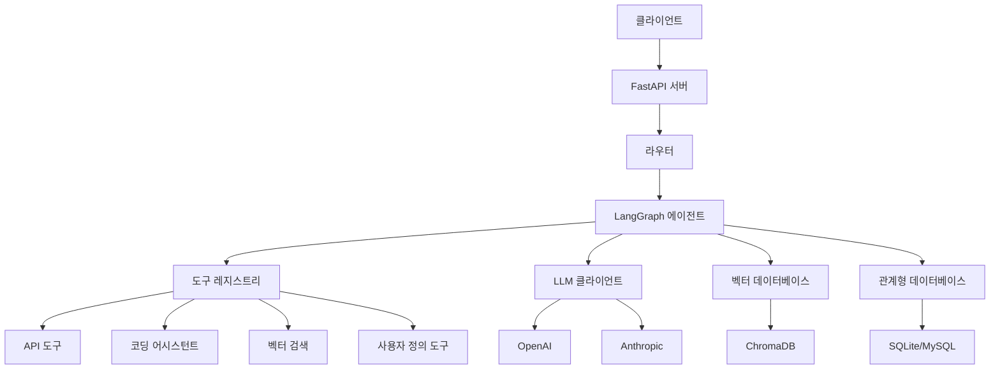
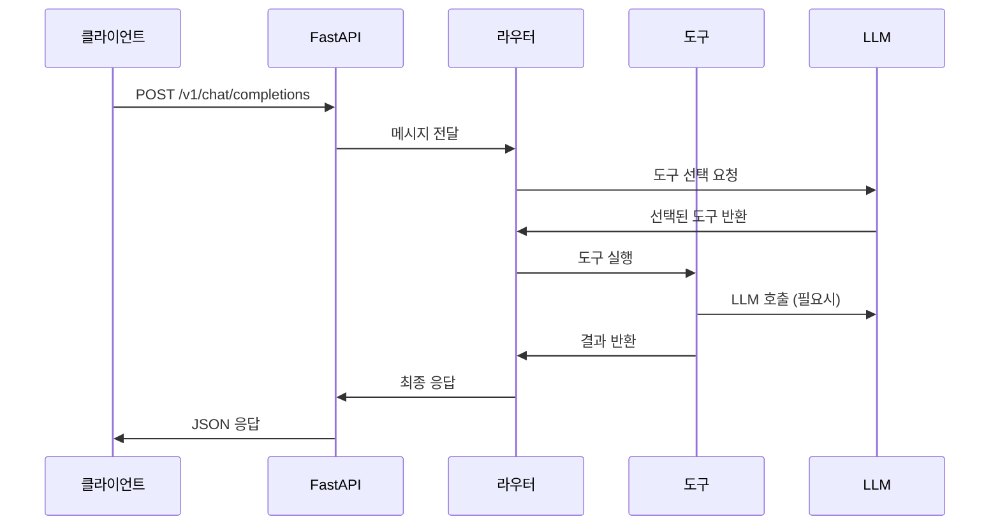
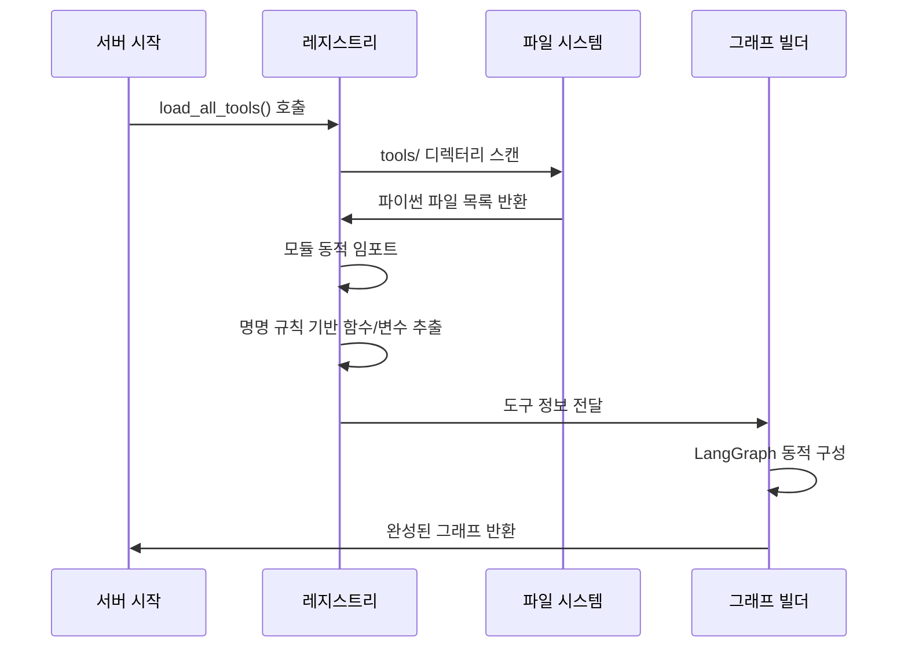

# 🏗️ CoE-Backend 아키텍처 가이드

## 📋 개요

CoE-Backend는 **도구 레지스트리 패턴**을 기반으로 한 확장 가능한 AI 에이전트 시스템입니다. LangGraph와 FastAPI를 활용하여 동적으로 도구를 로드하고 라우팅하는 혁신적인 아키텍처를 제공합니다.

## 🎯 핵심 설계 원칙

### 1. 모듈화 (Modularity)
- 각 도구는 독립적인 파일로 관리
- 기능별로 명확하게 분리된 컴포넌트
- 느슨한 결합(Loose Coupling)으로 유지보수성 향상

### 2. 확장성 (Extensibility)
- 새로운 도구 추가 시 기존 코드 수정 불필요
- 플러그인 방식의 도구 등록 시스템
- 동적 그래프 구성으로 복잡한 워크플로우 지원

### 3. 호환성 (Compatibility)
- OpenAI API 표준 준수
- 다양한 LLM 제공업체 지원
- 기존 AI 도구들과의 원활한 연동

## 🏛️ 시스템 아키텍처



## 🔧 핵심 컴포넌트

### 1. 도구 레지스트리 시스템

**위치**: `tools/registry.py`

```python
def load_all_tools():
    """모든 도구를 동적으로 로드하고 등록"""
    tools = {}
    descriptions = {}
    edges = {}
    
    # tools 디렉터리 스캔
    for file_path in Path("tools").glob("*.py"):
        module = importlib.import_module(f"tools.{file_path.stem}")
        
        # 규칙 기반 도구 발견
        for name, obj in inspect.getmembers(module):
            if name.endswith("_node") and callable(obj):
                tools[name] = obj
            elif name.endswith("_description"):
                descriptions[name] = obj
            elif name.endswith("_edges"):
                edges[name] = obj
    
    return tools, descriptions, edges
```

**특징:**
- 파일 기반 자동 발견
- 명명 규칙을 통한 자동 등록
- 런타임 동적 로딩

### 2. LangGraph 동적 구성

**위치**: `core/graph_builder.py`

```python
def build_dynamic_graph(tools, descriptions, edges):
    """도구 정보를 바탕으로 LangGraph 동적 구성"""
    
    # StateGraph 생성
    workflow = StateGraph(ChatState)
    
    # 라우터 노드 추가
    workflow.add_node("router", router_node)
    workflow.set_entry_point("router")
    
    # 도구 노드들 추가
    for tool_name, tool_func in tools.items():
        workflow.add_node(tool_name, tool_func)
        workflow.add_edge("router", tool_name)
    
    # 사용자 정의 엣지 추가
    for source, target in edges.items():
        workflow.add_edge(source, target)
    
    return workflow.compile()
```

**특징:**
- 런타임 그래프 구성
- 조건부 라우팅 지원
- 복잡한 워크플로우 처리

### 3. 라우터 시스템

**위치**: `core/router.py`

```python
async def router_node(state: ChatState) -> Dict[str, Any]:
    """LLM을 사용하여 적절한 도구 선택"""
    
    user_message = state["messages"][-1]["content"]
    available_tools = get_tool_descriptions()
    
    # LLM에게 도구 선택 요청
    prompt = f"""
    사용자 요청: {user_message}
    사용 가능한 도구들: {available_tools}
    
    가장 적합한 도구를 선택하세요.
    """
    
    response = await llm.ainvoke(prompt)
    selected_tool = parse_tool_selection(response.content)
    
    return {"next": selected_tool}
```

**특징:**
- LLM 기반 지능형 라우팅
- 컨텍스트 인식 도구 선택
- 동적 도구 목록 관리

## 📁 디렉터리 구조 상세

```
CoE-Backend/
├── main.py                 # 애플리케이션 진입점
├── 
├── api/                    # API 엔드포인트
│   ├── chat_api.py        # 채팅 API (OpenAI 호환)
│   ├── auth_api.py        # 인증 API
│   ├── embeddings_api.py  # 임베딩 API
│   └── ...
├── 
├── core/                   # 핵심 비즈니스 로직
│   ├── graph_builder.py   # LangGraph 동적 구성
│   ├── llm_client.py      # LLM 클라이언트 관리
│   ├── auth.py            # 인증 및 권한 관리
│   ├── database.py        # 데이터베이스 연결
│   ├── middleware.py      # 미들웨어 (CORS, 로깅)
│   ├── models.py          # 데이터 모델
│   └── schemas.py         # Pydantic 스키마
├── 
├── tools/                  # 도구 모듈 (핵심)
│   ├── registry.py        # 도구 자동 등록 시스템
│   ├── basic_tools.py     # 기본 도구들
│   ├── api_tool.py        # REST API 호출 도구
│   ├── langchain_tool.py  # LangChain 연동 도구
│   ├── human_tool.py      # Human-in-the-Loop 도구
│   └── coding_assistant/  # 코딩 어시스턴트 도구들
├── 
├── services/               # 비즈니스 서비스 레이어
│   ├── analysis_service.py # 분석 서비스
│   ├── db_service.py      # 데이터베이스 서비스
│   └── vector/            # 벡터 관련 서비스
└── 
└── utils/                  # 유틸리티 함수
    ├── streaming_utils.py # 스트리밍 관련
    └── coding_assistant/  # 코딩 어시스턴트 유틸리티
```

## 🔄 데이터 플로우

### 1. 요청 처리 플로우



### 2. 도구 등록 플로우



## 🛠️ 확장 포인트

### 1. 새로운 도구 추가

**단계:**
1. `tools/` 디렉터리에 새 파일 생성
2. 명명 규칙에 따라 함수/변수 정의
3. 서버 재시작으로 자동 등록

**예시:**
```python
# tools/weather_tool.py

weather_tool_description = {
    "name": "weather_tool",
    "description": "날씨 정보를 조회하는 도구"
}

async def weather_tool_node(state: ChatState) -> Dict[str, Any]:
    # 날씨 API 호출 로직
    weather_data = await get_weather_data()
    return {"messages": [{"role": "assistant", "content": weather_data}]}
```

### 2. 새로운 LLM 제공업체 추가

**위치**: `core/llm_client.py`

```python
def create_llm_client(provider: str, model: str):
    if provider == "openai":
        return ChatOpenAI(model=model)
    elif provider == "anthropic":
        return ChatAnthropic(model=model)
    elif provider == "custom":
        return CustomLLM(model=model)  # 새로운 제공업체
    else:
        raise ValueError(f"Unsupported provider: {provider}")
```

### 3. 새로운 API 엔드포인트 추가

**위치**: `api/` 디렉터리

```python
# api/custom_api.py
from fastapi import APIRouter

router = APIRouter(prefix="/custom", tags=["custom"])

@router.post("/endpoint")
async def custom_endpoint():
    # 커스텀 로직
    return {"result": "success"}
```

## 🔒 보안 고려사항

### 1. 인증 및 권한 관리
- JWT 기반 토큰 인증
- API 키 기반 접근 제어
- 역할 기반 권한 관리 (RBAC)

### 2. 입력 검증
- Pydantic 스키마를 통한 데이터 검증
- SQL 인젝션 방지
- XSS 공격 방지

### 3. 레이트 리미팅
- API 호출 빈도 제한
- 사용자별 할당량 관리
- DDoS 공격 방지

## 📊 성능 최적화

### 1. 비동기 처리
- FastAPI의 비동기 지원 활용
- 동시 요청 처리 최적화
- I/O 바운드 작업 비동기화

### 2. 캐싱 전략
- Redis를 통한 응답 캐싱
- 벡터 검색 결과 캐싱
- LLM 응답 캐싱

### 3. 데이터베이스 최적화
- 인덱스 최적화
- 쿼리 성능 튜닝
- 연결 풀 관리

## 🧪 테스트 전략

### 1. 단위 테스트
- 각 도구별 독립 테스트
- 모킹을 통한 외부 의존성 격리
- 커버리지 90% 이상 유지

### 2. 통합 테스트
- API 엔드포인트 테스트
- 데이터베이스 연동 테스트
- 외부 서비스 연동 테스트

### 3. 부하 테스트
- 동시 사용자 처리 능력 테스트
- 메모리 사용량 모니터링
- 응답 시간 성능 측정

## 🔮 향후 발전 방향

### 1. 마이크로서비스 아키텍처
- 도구별 독립 서비스 분리
- 서비스 메시 도입
- 컨테이너 오케스트레이션

### 2. 실시간 협업 기능
- WebSocket 기반 실시간 통신
- 다중 사용자 세션 관리
- 실시간 코드 편집 지원

### 3. AI 모델 최적화
- 모델 파인튜닝 지원
- 온디바이스 모델 실행
- 모델 성능 모니터링

---

이 아키텍처 가이드는 CoE-Backend의 설계 철학과 구현 세부사항을 제공합니다. 시스템을 이해하고 확장하는 데 도움이 되기를 바랍니다.